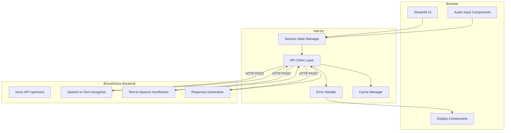
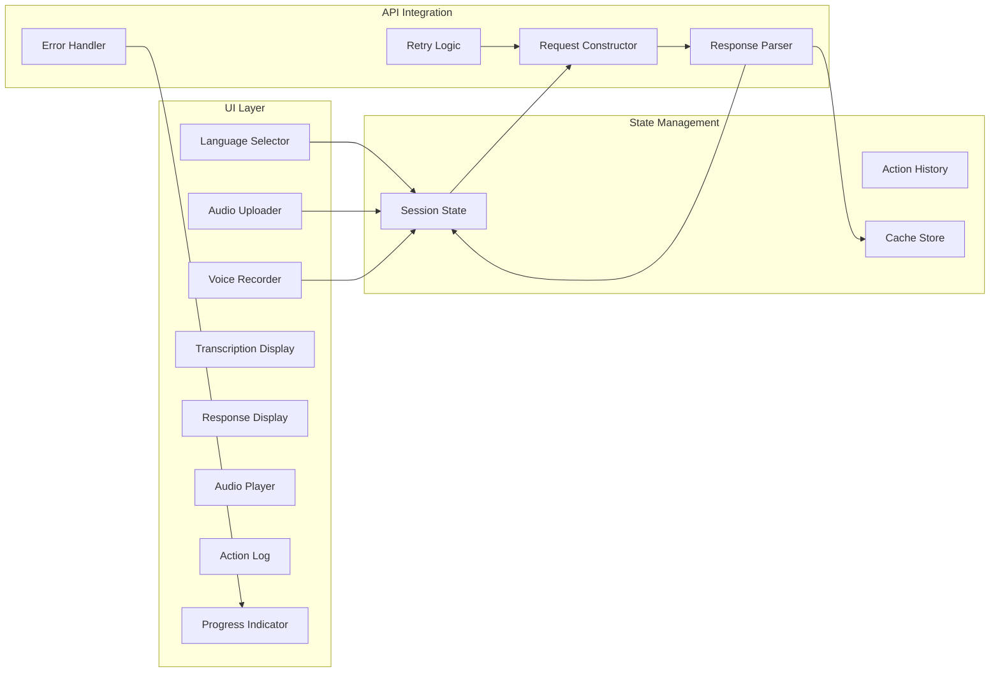
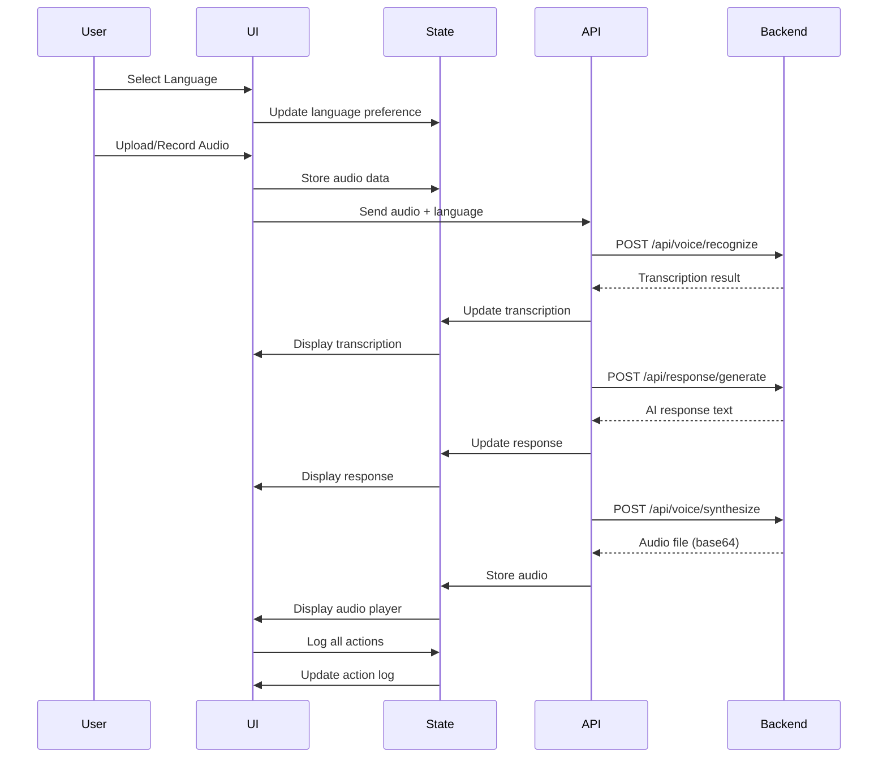

# Design Document: Streamlit Web Interface

## Overview

The Streamlit Web Interface provides a browser-based user interface for the BharatVoice AI system, enabling users to interact with the voice assistant through audio upload, browser-based recording, and real-time transcription and response playback. The interface is designed as a single-page application (SPA) implemented in a single `app.py` file, leveraging Streamlit's reactive programming model for state management and UI updates.

### Design Goals

1. **Simplicity**: Single-file implementation for easy deployment and maintenance
2. **Accessibility**: Support for 11 Indian languages with intuitive UI components
3. **Resilience**: Offline-first design with graceful degradation when backend is unavailable
4. **Performance**: Low-bandwidth optimization with progress indicators and caching
5. **Integration**: Seamless connection to existing BharatVoice backend services

### Key Design Decisions

- **Single-file architecture**: All UI logic, state management, and API integration in `app.py` for simplified deployment
- **Streamlit session state**: Leverage Streamlit's built-in session state for managing user interactions and action history
- **Synchronous API calls**: Use `requests` library with timeout handling for backend communication
- **Base64 audio encoding**: Encode audio files as base64 for JSON API communication
- **Environment-based configuration**: Use environment variables for backend URL configuration (localhost vs production)

## Architecture

### High-Level Architecture



### Component Architecture



### Data Flow



## Components and Interfaces

### 1. Language Selector Component

**Purpose**: Allow users to select their preferred language for interaction

**Implementation**:
```python
def render_language_selector():
    """Render language selection dropdown"""
    languages = {
        'hi': 'हिन्दी (Hindi)',
        'en-IN': 'English (India)',
        'ta': 'தமிழ் (Tamil)',
        'te': 'తెలుగు (Telugu)',
        'bn': 'বাংলা (Bengali)',
        'mr': 'मराठी (Marathi)',
        'gu': 'ગુજરાતી (Gujarati)',
        'kn': 'ಕನ್ನಡ (Kannada)',
        'ml': 'മലയാളം (Malayalam)',
        'pa': 'ਪੰਜਾਬੀ (Punjabi)',
        'or': 'ଓଡ଼ିଆ (Odia)'
    }
    
    selected = st.selectbox(
        "Select Language / भाषा चुनें",
        options=list(languages.keys()),
        format_func=lambda x: languages[x],
        key='selected_language'
    )
    
    return selected
```

**State Management**:
- Stores selected language in `st.session_state.selected_language`
- Persists across page reloads within the same session

### 2. Audio Uploader Component

**Purpose**: Enable users to upload pre-recorded audio files

**Implementation**:
```python
def render_audio_uploader():
    """Render audio file upload widget"""
    uploaded_file = st.file_uploader(
        "Upload Audio File / ऑडियो फ़ाइल अपलोड करें",
        type=['wav', 'mp3', 'm4a', 'ogg'],
        key='audio_uploader'
    )
    
    if uploaded_file:
        # Validate file size (max 10MB)
        if uploaded_file.size > 10 * 1024 * 1024:
            st.error("File size exceeds 10MB limit")
            return None
        
        # Store in session state
        st.session_state.audio_data = uploaded_file.read()
        st.session_state.audio_filename = uploaded_file.name
        
        return uploaded_file
    
    return None
```

**Validation**:
- File format: WAV, MP3, M4A, OGG
- Maximum size: 10MB
- Error messages displayed inline

### 3. Voice Recorder Component

**Purpose**: Enable browser-based audio recording

**Implementation**:
```python
def render_voice_recorder():
    """Render voice recording interface using audio_recorder"""
    from audio_recorder_streamlit import audio_recorder
    
    st.write("Record Audio / ऑडियो रिकॉर्ड करें")
    
    audio_bytes = audio_recorder(
        pause_threshold=2.0,
        sample_rate=16000,
        text="Click to record",
        recording_color="#e74c3c",
        neutral_color="#3498db",
        icon_name="microphone",
        icon_size="3x"
    )
    
    if audio_bytes:
        st.session_state.audio_data = audio_bytes
        st.session_state.audio_filename = "recorded_audio.wav"
        st.audio(audio_bytes, format='audio/wav')
        
        return audio_bytes
    
    return None
```

**Dependencies**:
- `audio-recorder-streamlit` package for browser recording
- Requires HTTPS for microphone access in production

### 4. Transcription Display Component

**Purpose**: Show speech-to-text transcription results

**Implementation**:
```python
def render_transcription_display():
    """Render transcription results"""
    if 'transcription' in st.session_state:
        st.subheader("Transcription / प्रतिलेखन")
        
        transcription = st.session_state.transcription
        
        # Display transcription text
        st.info(transcription['text'])
        
        # Display metadata
        col1, col2, col3 = st.columns(3)
        with col1:
            st.metric("Confidence", f"{transcription['confidence']:.2%}")
        with col2:
            st.metric("Language", transcription['detected_language'])
        with col3:
            st.metric("Processing Time", f"{transcription['processing_time']:.2f}s")
```

**Data Structure**:
```python
{
    'text': str,
    'confidence': float,
    'detected_language': str,
    'processing_time': float,
    'alternatives': List[str]
}
```

### 5. Response Display Component

**Purpose**: Show AI-generated response text

**Implementation**:
```python
def render_response_display():
    """Render AI response"""
    if 'response' in st.session_state:
        st.subheader("Response / प्रतिक्रिया")
        
        response = st.session_state.response
        
        # Display response text
        st.success(response['text'])
        
        # Display suggested actions if available
        if response.get('suggested_actions'):
            st.write("Suggested Actions:")
            for action in response['suggested_actions']:
                st.button(action['label'], key=f"action_{action['id']}")
```

### 6. Audio Player Component

**Purpose**: Play TTS-generated audio responses

**Implementation**:
```python
def render_audio_player():
    """Render audio player for TTS response"""
    if 'tts_audio' in st.session_state:
        st.subheader("Audio Response / ऑडियो प्रतिक्रिया")
        
        audio_data = st.session_state.tts_audio
        
        # Decode base64 audio if needed
        if isinstance(audio_data, str):
            import base64
            audio_bytes = base64.b64decode(audio_data)
        else:
            audio_bytes = audio_data
        
        st.audio(audio_bytes, format='audio/wav')
        
        # Auto-play option
        if st.session_state.get('auto_play', True):
            st.markdown(
                f'<audio autoplay><source src="data:audio/wav;base64,{audio_data}"></audio>',
                unsafe_allow_html=True
            )
```

### 7. Action Log Component

**Purpose**: Display history of user interactions

**Implementation**:
```python
def render_action_log():
    """Render action history log"""
    st.sidebar.subheader("Action Log / कार्य लॉग")
    
    if 'action_history' not in st.session_state:
        st.session_state.action_history = []
    
    # Display most recent 10 actions
    for action in reversed(st.session_state.action_history[-10:]):
        with st.sidebar.expander(f"{action['timestamp']} - {action['type']}"):
            st.write(f"**Type**: {action['type']}")
            st.write(f"**Status**: {action['status']}")
            if 'details' in action:
                st.write(f"**Details**: {action['details']}")
```

**Action Structure**:
```python
{
    'timestamp': str,  # ISO format
    'type': str,  # 'upload', 'record', 'transcribe', 'respond', 'tts'
    'status': str,  # 'success', 'error', 'pending'
    'details': str  # Additional information
}
```

### 8. Progress Indicator Component

**Purpose**: Show processing status and loading states

**Implementation**:
```python
def render_progress_indicator(operation: str, progress: float = None):
    """Render progress indicator"""
    if progress is not None:
        st.progress(progress)
    else:
        with st.spinner(f'{operation}...'):
            pass
    
    # Estimated time for long operations
    if 'operation_start_time' in st.session_state:
        elapsed = time.time() - st.session_state.operation_start_time
        if elapsed > 3:
            st.info(f"Processing... ({elapsed:.1f}s elapsed)")
```

## Data Models

### Session State Schema

```python
class SessionState:
    """Session state data structure"""
    
    # User preferences
    selected_language: str = 'hi'
    auto_play: bool = True
    
    # Audio data
    audio_data: Optional[bytes] = None
    audio_filename: Optional[str] = None
    
    # Processing results
    transcription: Optional[Dict] = None
    response: Optional[Dict] = None
    tts_audio: Optional[Union[str, bytes]] = None
    
    # Action history
    action_history: List[Dict] = []
    
    # Cache
    cache: Dict[str, Any] = {}
    
    # Status
    is_processing: bool = False
    operation_start_time: Optional[float] = None
    error_message: Optional[str] = None
    offline_mode: bool = False
```

### API Request/Response Models

**Speech Recognition Request**:
```python
{
    'audio_file': bytes,  # Multipart form data
    'language': str,  # ISO language code
    'enable_code_switching': bool,
    'max_alternatives': int
}
```

**Speech Recognition Response**:
```python
{
    'request_id': str,
    'result': {
        'transcribed_text': str,
        'confidence': float,
        'detected_language': str,
        'code_switching_points': List[Dict],
        'alternative_transcriptions': List[str],
        'processing_time': float
    },
    'processing_time': float
}
```

**Text-to-Speech Request**:
```python
{
    'text': str,
    'language': str,
    'accent': str,
    'speed': float,
    'pitch': float
}
```

**Text-to-Speech Response**:
```python
{
    'request_id': str,
    'audio_url': str,
    'duration': float,
    'format': str
}
```

### API Client Interface

```python
class BharatVoiceAPIClient:
    """API client for BharatVoice backend"""
    
    def __init__(self, base_url: str, timeout: int = 30):
        self.base_url = base_url
        self.timeout = timeout
        self.session = requests.Session()
    
    def recognize_speech(
        self,
        audio_data: bytes,
        language: str,
        enable_code_switching: bool = True
    ) -> Dict:
        """Send audio for speech recognition"""
        pass
    
    def generate_response(
        self,
        text: str,
        language: str,
        context: Optional[Dict] = None
    ) -> Dict:
        """Generate AI response from text"""
        pass
    
    def synthesize_speech(
        self,
        text: str,
        language: str,
        accent: str = 'standard'
    ) -> bytes:
        """Generate TTS audio from text"""
        pass
    
    def check_health(self) -> bool:
        """Check backend health status"""
        pass
```


## API Integration Patterns

### Request Construction

**Audio Upload Pattern**:
```python
def send_audio_for_recognition(audio_data: bytes, language: str) -> Dict:
    """Send audio to backend for speech recognition"""
    
    url = f"{BACKEND_URL}/api/voice/recognize"
    
    files = {
        'audio_file': ('audio.wav', audio_data, 'audio/wav')
    }
    
    data = {
        'language': language,
        'enable_code_switching': True,
        'max_alternatives': 3
    }
    
    try:
        response = requests.post(
            url,
            files=files,
            data=data,
            timeout=30
        )
        response.raise_for_status()
        return response.json()
    
    except requests.exceptions.Timeout:
        raise APIError("Request timed out")
    except requests.exceptions.ConnectionError:
        raise APIError("Cannot connect to backend")
    except requests.exceptions.HTTPError as e:
        raise APIError(f"HTTP error: {e.response.status_code}")
```

**JSON Request Pattern**:
```python
def send_text_for_tts(text: str, language: str) -> bytes:
    """Send text to backend for TTS synthesis"""
    
    url = f"{BACKEND_URL}/api/voice/synthesize"
    
    payload = {
        'text': text,
        'language': language,
        'accent': 'standard',
        'speed': 1.0,
        'pitch': 1.0
    }
    
    headers = {
        'Content-Type': 'application/json'
    }
    
    try:
        response = requests.post(
            url,
            json=payload,
            headers=headers,
            timeout=30
        )
        response.raise_for_status()
        
        # Get audio URL from response
        result = response.json()
        audio_url = result['audio_url']
        
        # Fetch audio file
        audio_response = requests.get(
            f"{BACKEND_URL}{audio_url}",
            timeout=30
        )
        audio_response.raise_for_status()
        
        return audio_response.content
    
    except Exception as e:
        raise APIError(f"TTS synthesis failed: {str(e)}")
```

### Response Parsing

**Transcription Response Parser**:
```python
def parse_transcription_response(response: Dict) -> Dict:
    """Parse speech recognition response"""
    
    result = response.get('result', {})
    
    return {
        'text': result.get('transcribed_text', ''),
        'confidence': result.get('confidence', 0.0),
        'detected_language': result.get('detected_language', 'unknown'),
        'processing_time': result.get('processing_time', 0.0),
        'alternatives': result.get('alternative_transcriptions', [])
    }
```

**Error Response Parser**:
```python
def parse_error_response(response: requests.Response) -> str:
    """Parse error response and extract user-friendly message"""
    
    try:
        error_data = response.json()
        detail = error_data.get('detail', 'Unknown error')
        
        # Map technical errors to user-friendly messages
        error_messages = {
            'Invalid audio file format': 'Please upload a valid audio file (WAV, MP3, M4A, or OGG)',
            'Text too long': 'Your message is too long. Please keep it under 5000 characters',
            'Speech recognition failed': 'Could not understand the audio. Please try again',
            'Speech synthesis failed': 'Could not generate audio response. Please try again'
        }
        
        return error_messages.get(detail, detail)
    
    except:
        return f"Error: {response.status_code}"
```

### Retry Logic

**Exponential Backoff Strategy**:
```python
def retry_with_backoff(
    func: Callable,
    max_retries: int = 3,
    initial_delay: float = 1.0,
    backoff_factor: float = 2.0
) -> Any:
    """Retry function with exponential backoff"""
    
    delay = initial_delay
    
    for attempt in range(max_retries):
        try:
            return func()
        
        except (requests.exceptions.Timeout, requests.exceptions.ConnectionError) as e:
            if attempt == max_retries - 1:
                raise
            
            st.warning(f"Attempt {attempt + 1} failed. Retrying in {delay:.1f}s...")
            time.sleep(delay)
            delay *= backoff_factor
    
    raise Exception("Max retries exceeded")
```

### Connection Health Check

**Backend Health Monitoring**:
```python
def check_backend_health() -> bool:
    """Check if backend is reachable"""
    
    try:
        response = requests.get(
            f"{BACKEND_URL}/api/health",
            timeout=5
        )
        return response.status_code == 200
    
    except:
        return False

def update_connection_status():
    """Update connection status in session state"""
    
    is_online = check_backend_health()
    
    if is_online != st.session_state.get('is_online', True):
        st.session_state.is_online = is_online
        
        if is_online:
            st.success("✅ Connected to backend")
            log_action('connection', 'success', 'Backend connection restored')
        else:
            st.error("❌ Backend unavailable - Operating in offline mode")
            log_action('connection', 'error', 'Backend connection lost')
```

## State Management

### Session State Initialization

```python
def initialize_session_state():
    """Initialize session state variables"""
    
    # User preferences
    if 'selected_language' not in st.session_state:
        st.session_state.selected_language = 'hi'
    
    if 'auto_play' not in st.session_state:
        st.session_state.auto_play = True
    
    # Audio data
    if 'audio_data' not in st.session_state:
        st.session_state.audio_data = None
    
    if 'audio_filename' not in st.session_state:
        st.session_state.audio_filename = None
    
    # Processing results
    if 'transcription' not in st.session_state:
        st.session_state.transcription = None
    
    if 'response' not in st.session_state:
        st.session_state.response = None
    
    if 'tts_audio' not in st.session_state:
        st.session_state.tts_audio = None
    
    # Action history
    if 'action_history' not in st.session_state:
        st.session_state.action_history = []
    
    # Cache
    if 'cache' not in st.session_state:
        st.session_state.cache = {}
    
    # Status
    if 'is_processing' not in st.session_state:
        st.session_state.is_processing = False
    
    if 'is_online' not in st.session_state:
        st.session_state.is_online = True
```

### Action Logging

```python
def log_action(action_type: str, status: str, details: str = ''):
    """Log user action to history"""
    
    action = {
        'timestamp': datetime.now().isoformat(),
        'type': action_type,
        'status': status,
        'details': details
    }
    
    st.session_state.action_history.append(action)
    
    # Keep only last 50 actions
    if len(st.session_state.action_history) > 50:
        st.session_state.action_history = st.session_state.action_history[-50:]
```

### Cache Management

```python
def cache_response(key: str, value: Any, ttl: int = 3600):
    """Cache response with TTL"""
    
    cache_entry = {
        'value': value,
        'timestamp': time.time(),
        'ttl': ttl
    }
    
    st.session_state.cache[key] = cache_entry

def get_cached_response(key: str) -> Optional[Any]:
    """Get cached response if not expired"""
    
    if key not in st.session_state.cache:
        return None
    
    entry = st.session_state.cache[key]
    
    # Check if expired
    if time.time() - entry['timestamp'] > entry['ttl']:
        del st.session_state.cache[key]
        return None
    
    return entry['value']

def clear_cache():
    """Clear all cached responses"""
    st.session_state.cache = {}
```

## Offline Detection and Caching Strategy

### Offline Detection

**Connection Monitoring**:
```python
def monitor_connection():
    """Monitor backend connection status"""
    
    # Check connection every 30 seconds
    if 'last_health_check' not in st.session_state:
        st.session_state.last_health_check = 0
    
    current_time = time.time()
    
    if current_time - st.session_state.last_health_check > 30:
        update_connection_status()
        st.session_state.last_health_check = current_time
```

**Offline Mode UI**:
```python
def render_offline_indicator():
    """Render offline mode indicator"""
    
    if not st.session_state.get('is_online', True):
        st.warning("""
        ⚠️ **Offline Mode** / **ऑफ़लाइन मोड**
        
        The backend is currently unavailable. Some features are disabled:
        - Speech recognition
        - AI response generation
        - Text-to-speech synthesis
        
        You can still:
        - View cached responses
        - Browse action history
        - Upload audio files (will be processed when connection is restored)
        """)
```

### Caching Strategy

**Response Caching**:
```python
def process_with_cache(
    cache_key: str,
    processor: Callable,
    ttl: int = 3600
) -> Any:
    """Process request with caching"""
    
    # Check cache first
    cached = get_cached_response(cache_key)
    if cached:
        st.info("📦 Loaded from cache")
        return cached
    
    # Process request
    result = processor()
    
    # Cache result
    cache_response(cache_key, result, ttl)
    
    return result
```

**Audio Caching**:
```python
def cache_audio_file(audio_data: bytes, filename: str):
    """Cache audio file locally"""
    
    cache_dir = Path('.streamlit_cache')
    cache_dir.mkdir(exist_ok=True)
    
    file_hash = hashlib.md5(audio_data).hexdigest()
    cache_path = cache_dir / f"{file_hash}_{filename}"
    
    with open(cache_path, 'wb') as f:
        f.write(audio_data)
    
    return str(cache_path)

def get_cached_audio(filename: str) -> Optional[bytes]:
    """Get cached audio file"""
    
    cache_dir = Path('.streamlit_cache')
    
    for cache_file in cache_dir.glob(f"*_{filename}"):
        with open(cache_file, 'rb') as f:
            return f.read()
    
    return None
```

**Offline Queue**:
```python
def queue_for_offline_processing(operation: str, data: Dict):
    """Queue operation for processing when online"""
    
    if 'offline_queue' not in st.session_state:
        st.session_state.offline_queue = []
    
    queue_item = {
        'operation': operation,
        'data': data,
        'timestamp': datetime.now().isoformat()
    }
    
    st.session_state.offline_queue.append(queue_item)
    
    st.info(f"Operation queued for processing when connection is restored")

def process_offline_queue():
    """Process queued operations when connection is restored"""
    
    if 'offline_queue' not in st.session_state:
        return
    
    if not st.session_state.offline_queue:
        return
    
    if not st.session_state.get('is_online', False):
        return
    
    st.info(f"Processing {len(st.session_state.offline_queue)} queued operations...")
    
    for item in st.session_state.offline_queue:
        try:
            # Process based on operation type
            if item['operation'] == 'transcribe':
                process_audio(item['data']['audio_data'], item['data']['language'])
            
            log_action(item['operation'], 'success', 'Processed from offline queue')
        
        except Exception as e:
            log_action(item['operation'], 'error', f'Failed to process: {str(e)}')
    
    # Clear queue
    st.session_state.offline_queue = []
```

## Error Handling

### Error Types and Recovery

**Network Errors**:
```python
def handle_network_error(error: Exception, operation: str):
    """Handle network-related errors"""
    
    error_message = f"Network error during {operation}"
    
    if isinstance(error, requests.exceptions.Timeout):
        st.error(f"⏱️ Request timed out. The server is taking too long to respond.")
        
        if st.button("Retry"):
            st.rerun()
    
    elif isinstance(error, requests.exceptions.ConnectionError):
        st.error(f"🔌 Cannot connect to backend. Please check your internet connection.")
        
        # Switch to offline mode
        st.session_state.is_online = False
        
        if st.button("Retry Connection"):
            update_connection_status()
            st.rerun()
    
    else:
        st.error(f"❌ {error_message}: {str(error)}")
    
    log_action(operation, 'error', str(error))
```

**Validation Errors**:
```python
def handle_validation_error(error: str, field: str):
    """Handle input validation errors"""
    
    validation_messages = {
        'audio_format': """
        ❌ **Invalid Audio Format**
        
        Please upload a file in one of these formats:
        - WAV (.wav)
        - MP3 (.mp3)
        - M4A (.m4a)
        - OGG (.ogg)
        """,
        
        'audio_size': """
        ❌ **File Too Large**
        
        Maximum file size is 10MB. Please:
        - Use a shorter recording
        - Compress the audio file
        - Use a lower bitrate
        """,
        
        'text_length': """
        ❌ **Text Too Long**
        
        Maximum text length is 5000 characters.
        Please shorten your message.
        """
    }
    
    message = validation_messages.get(field, f"Validation error: {error}")
    st.error(message)
    
    log_action('validation', 'error', f"{field}: {error}")
```

**API Errors**:
```python
def handle_api_error(response: requests.Response, operation: str):
    """Handle API error responses"""
    
    status_code = response.status_code
    
    if status_code == 400:
        error_detail = parse_error_response(response)
        st.error(f"❌ Invalid request: {error_detail}")
    
    elif status_code == 401:
        st.error("🔒 Authentication required. Please log in.")
    
    elif status_code == 403:
        st.error("🚫 Access denied. You don't have permission for this operation.")
    
    elif status_code == 404:
        st.error("🔍 Resource not found. The requested endpoint doesn't exist.")
    
    elif status_code == 429:
        st.error("⏸️ Rate limit exceeded. Please wait before trying again.")
        
        # Extract retry-after header if available
        retry_after = response.headers.get('Retry-After', '60')
        st.info(f"Please wait {retry_after} seconds before retrying.")
    
    elif status_code == 500:
        st.error("⚠️ Server error. The backend encountered an internal error.")
        
        if st.button("Report Issue"):
            report_error(response, operation)
    
    elif status_code == 503:
        st.error("🔧 Service unavailable. The backend is temporarily down for maintenance.")
    
    else:
        st.error(f"❌ Unexpected error: {status_code}")
    
    log_action(operation, 'error', f"HTTP {status_code}")
```

### Error Recovery Mechanisms

**Automatic Retry**:
```python
def process_with_retry(
    operation: Callable,
    operation_name: str,
    max_retries: int = 3
) -> Any:
    """Process operation with automatic retry"""
    
    for attempt in range(max_retries):
        try:
            return operation()
        
        except (requests.exceptions.Timeout, requests.exceptions.ConnectionError) as e:
            if attempt < max_retries - 1:
                wait_time = 2 ** attempt  # Exponential backoff
                st.warning(f"Attempt {attempt + 1} failed. Retrying in {wait_time}s...")
                time.sleep(wait_time)
            else:
                handle_network_error(e, operation_name)
                raise
        
        except requests.exceptions.HTTPError as e:
            handle_api_error(e.response, operation_name)
            raise
        
        except Exception as e:
            st.error(f"Unexpected error: {str(e)}")
            log_action(operation_name, 'error', str(e))
            raise
```

**Graceful Degradation**:
```python
def process_audio_with_fallback(audio_data: bytes, language: str):
    """Process audio with fallback to offline mode"""
    
    try:
        # Try online processing
        if st.session_state.get('is_online', True):
            return process_audio_online(audio_data, language)
    
    except Exception as e:
        st.warning("Online processing failed. Attempting offline processing...")
        log_action('transcribe', 'warning', 'Falling back to offline mode')
    
    # Fallback to offline processing
    try:
        return process_audio_offline(audio_data, language)
    
    except Exception as e:
        st.error("Both online and offline processing failed.")
        
        # Queue for later processing
        queue_for_offline_processing('transcribe', {
            'audio_data': audio_data,
            'language': language
        })
        
        return None
```


## Correctness Properties

*A property is a characteristic or behavior that should hold true across all valid executions of a system-essentially, a formal statement about what the system should do. Properties serve as the bridge between human-readable specifications and machine-verifiable correctness guarantees.*

### Property 1: Audio File Size Validation

*For any* audio file (uploaded or recorded) that exceeds 10MB, the interface should reject the file and display a warning message.

**Validates: Requirements 1.5**

### Property 2: Recording State Persistence

*For any* recording session, when the user stops recording, the audio data should be stored in session state and made available for processing.

**Validates: Requirements 1.4**

### Property 3: Language Selection Persistence

*For any* language selection made by the user, the selected language should be stored in session state and persist throughout the session.

**Validates: Requirements 2.2**

### Property 4: Language Propagation to API

*For any* audio processing request, the API call should include the currently selected language from session state.

**Validates: Requirements 2.3**

### Property 5: Language Change Application

*For any* language change during a session, all subsequent API requests should use the newly selected language.

**Validates: Requirements 2.5**

### Property 6: Speech Recognition API Integration

*For any* audio submission, the interface should send the audio file and selected language to the correct Backend_API speech-to-text endpoint with proper multipart/form-data encoding.

**Validates: Requirements 3.1, 12.1**

### Property 7: Transcription Display

*For any* transcription result received from the backend, the transcribed text should be displayed in the transcription component.

**Validates: Requirements 3.2**

### Property 8: Progress Indicator During Processing

*For any* active backend operation (transcription, response generation, or TTS), the progress indicator should display a loading state.

**Validates: Requirements 3.3, 4.3, 5.4, 8.1**

### Property 9: Error Message Display

*For any* operation failure (transcription, response generation, or TTS), an error message should be displayed to the user.

**Validates: Requirements 3.4, 4.4**

### Property 10: Action Logging Completeness

*For any* user interaction (audio upload, recording, transcription, response generation, TTS playback), an entry with timestamp should be added to the action log.

**Validates: Requirements 3.5, 4.5, 6.1, 6.2, 6.3, 6.4**

### Property 11: Automatic Response Generation

*For any* successful transcription, the interface should automatically trigger a response generation request to the backend.

**Validates: Requirements 4.1**

### Property 12: Response Display

*For any* text response received from the backend, the response text should be displayed in the response component.

**Validates: Requirements 4.2**

### Property 13: Retry Option on Failure

*For any* operation failure, the interface should provide a retry option to the user.

**Validates: Requirements 4.4, 10.1, 10.4**

### Property 14: Automatic TTS Request

*For any* text response received, the interface should automatically trigger a TTS synthesis request to the backend.

**Validates: Requirements 5.1**

### Property 15: Audio Player Display

*For any* TTS audio received, an audio player widget should be displayed with the audio data.

**Validates: Requirements 5.2**

### Property 16: Graceful TTS Degradation

*For any* TTS generation failure, the text response should still be displayed and the error should be logged.

**Validates: Requirements 5.5**

### Property 17: Action Log Display Limit

*For any* state of the action log, only the most recent 10 interactions should be displayed in reverse chronological order.

**Validates: Requirements 6.5**

### Property 18: Offline Detection

*For any* backend connection failure, the interface should detect the failure and display an offline status indicator.

**Validates: Requirements 7.1**

### Property 19: Feature Disabling in Offline Mode

*For any* offline state, features requiring backend connectivity should be disabled in the UI.

**Validates: Requirements 7.2**

### Property 20: Feature Re-enabling on Connection Restore

*For any* connection restoration event, previously disabled online features should be automatically re-enabled.

**Validates: Requirements 7.3**

### Property 21: Cache Indicator Display

*For any* cached response displayed to the user, a cache indicator should be shown alongside the response.

**Validates: Requirements 7.5**

### Property 22: Extended Processing Time Feedback

*For any* backend operation exceeding 3 seconds, the progress indicator should display an estimated time remaining message.

**Validates: Requirements 8.2**

### Property 23: Success Message Display

*For any* successfully completed operation, a success message should be displayed for 2 seconds.

**Validates: Requirements 8.3**

### Property 24: Detailed Error Messages

*For any* error occurrence, the progress indicator should display an error message with details about what went wrong.

**Validates: Requirements 8.4**

### Property 25: Network Error Handling

*For any* network error, the interface should display a user-friendly error message with a retry option.

**Validates: Requirements 10.1**

### Property 26: Invalid Audio File Feedback

*For any* invalid audio file upload, the interface should display format requirements and suggest corrections.

**Validates: Requirements 10.2**

### Property 27: Backend Error Message Localization

*For any* backend error response, the error message should be parsed and displayed in the user's currently selected language.

**Validates: Requirements 10.3**

### Property 28: Timeout Handling

*For any* request timeout, the interface should provide options to cancel and retry the operation.

**Validates: Requirements 10.4**

### Property 29: Critical Error Logging and Reporting

*For any* critical error, the error details should be logged and a reporting mechanism should be provided to the user.

**Validates: Requirements 10.5**

### Property 30: Configuration Source Reading

*For any* application startup, the interface should read backend API configuration from environment variables or a config file.

**Validates: Requirements 11.2**

### Property 31: JSON Response Validation

*For any* JSON response received from the backend, the interface should parse and validate the response structure before using the data.

**Validates: Requirements 12.2**

### Property 32: Base64 Audio Decoding

*For any* base64-encoded audio data received from the backend, the interface should correctly decode it to binary audio data.

**Validates: Requirements 12.3**

### Property 33: ISO Language Code Consistency

*For any* language selection, the interface should use ISO language codes that match the Backend_API specification.

**Validates: Requirements 12.4**

### Property 34: API Data Round-Trip Consistency

*For any* API request-response cycle, the data structure sent should be compatible with the data structure received, maintaining consistency throughout the round trip.

**Validates: Requirements 12.5**

## Testing Strategy

### Dual Testing Approach

The Streamlit Web Interface will be tested using both unit tests and property-based tests to ensure comprehensive coverage:

**Unit Tests**: Focus on specific examples, edge cases, and integration points
- Test specific UI component rendering
- Test error handling for known error scenarios
- Test configuration loading with specific values
- Test cache expiration logic
- Test offline queue processing

**Property-Based Tests**: Verify universal properties across all inputs
- Test audio file validation with randomly generated file sizes
- Test language selection persistence with all supported languages
- Test API request construction with random audio data and languages
- Test action log ordering with random interaction sequences
- Test error message display with various error types

### Property-Based Testing Configuration

**Testing Library**: We will use `hypothesis` for Python property-based testing

**Test Configuration**:
- Minimum 100 iterations per property test
- Each test will be tagged with a comment referencing the design property
- Tag format: `# Feature: streamlit-web-interface, Property {number}: {property_text}`

**Example Property Test Structure**:
```python
from hypothesis import given, strategies as st
import pytest

# Feature: streamlit-web-interface, Property 1: Audio File Size Validation
@given(file_size=st.integers(min_value=0, max_value=20*1024*1024))
@pytest.mark.property_test
def test_audio_file_size_validation(file_size):
    """For any audio file exceeding 10MB, the interface should reject it"""
    
    # Create mock audio data of specified size
    audio_data = b'0' * file_size
    
    # Test validation
    is_valid, error_message = validate_audio_file_size(audio_data)
    
    if file_size > 10 * 1024 * 1024:
        assert not is_valid
        assert error_message is not None
        assert "10MB" in error_message
    else:
        assert is_valid
        assert error_message is None
```

### Unit Test Coverage Areas

1. **Component Rendering**:
   - Language selector displays all 11 languages
   - Audio uploader accepts correct file formats
   - Action log displays in sidebar

2. **State Management**:
   - Session state initialization
   - State persistence across interactions
   - Cache management and expiration

3. **API Integration**:
   - Request construction with correct headers
   - Response parsing for different response types
   - Error response handling

4. **Error Handling**:
   - Network timeout handling
   - Invalid file format handling
   - Backend error message parsing

5. **Offline Functionality**:
   - Connection status detection
   - Feature disabling in offline mode
   - Offline queue management

### Integration Testing

**Backend Integration Tests**:
- Test complete workflow: audio upload → transcription → response → TTS
- Test error recovery with backend failures
- Test offline mode transitions
- Test cache behavior with real backend responses

**Browser Integration Tests** (using Selenium or Playwright):
- Test audio recording functionality
- Test file upload interactions
- Test audio playback
- Test responsive layout on different screen sizes

### Test Data Generation

**Audio Test Data**:
- Generate audio files of various sizes (1KB to 15MB)
- Generate audio files in different formats (WAV, MP3, M4A, OGG)
- Generate invalid audio files for error testing

**Language Test Data**:
- Test with all 11 supported languages
- Test language switching scenarios
- Test with invalid language codes

**API Response Test Data**:
- Mock successful transcription responses
- Mock error responses with different status codes
- Mock timeout scenarios
- Mock malformed JSON responses

### Performance Testing

**Load Testing**:
- Test with multiple concurrent users
- Test with large audio files (approaching 10MB limit)
- Test cache performance with many cached items

**Latency Testing**:
- Measure response time for each API call
- Test progress indicator accuracy
- Test timeout handling at various thresholds

### Accessibility Testing

**Manual Testing**:
- Test with screen readers
- Test keyboard navigation
- Test color contrast for error messages
- Test with browser zoom at 200%

**Automated Testing**:
- Use axe-core for accessibility violations
- Test ARIA labels on interactive elements
- Test focus management

## Deployment Configuration

### Local Development Setup

**Prerequisites**:
```bash
# Python 3.9+
python --version

# Install dependencies
pip install streamlit requests audio-recorder-streamlit python-dotenv
```

**Environment Configuration** (`.env`):
```bash
# Backend API URL
BACKEND_URL=http://localhost:8000

# Optional: Enable debug mode
DEBUG=true

# Optional: Cache TTL in seconds
CACHE_TTL=3600

# Optional: Request timeout in seconds
REQUEST_TIMEOUT=30
```

**Running Locally**:
```bash
# Start the Streamlit app
streamlit run app.py

# The app will be available at http://localhost:8501
```

**Backend Setup**:
```bash
# In a separate terminal, start the BharatVoice backend
cd src/bharatvoice
uvicorn main:app --reload --host 0.0.0.0 --port 8000
```

### AWS Amplify Deployment

**Project Structure**:
```
project-root/
├── app.py                 # Streamlit application
├── requirements.txt       # Python dependencies
├── .streamlit/
│   └── config.toml       # Streamlit configuration
├── amplify.yml           # Amplify build configuration
└── .env.production       # Production environment variables
```

**requirements.txt**:
```
streamlit==1.28.0
requests==2.31.0
audio-recorder-streamlit==0.0.8
python-dotenv==1.0.0
```

**Streamlit Configuration** (`.streamlit/config.toml`):
```toml
[server]
port = 8501
enableCORS = false
enableXsrfProtection = true

[browser]
gatherUsageStats = false

[theme]
primaryColor = "#FF6B35"
backgroundColor = "#FFFFFF"
secondaryBackgroundColor = "#F0F2F6"
textColor = "#262730"
font = "sans serif"
```

**Amplify Build Configuration** (`amplify.yml`):
```yaml
version: 1
frontend:
  phases:
    preBuild:
      commands:
        - pip install -r requirements.txt
    build:
      commands:
        - echo "Building Streamlit app..."
  artifacts:
    baseDirectory: /
    files:
      - '**/*'
  cache:
    paths:
      - '.streamlit_cache/**/*'
```

**Production Environment Variables** (`.env.production`):
```bash
# Production backend API URL
BACKEND_URL=https://api.bharatvoice.example.com

# Disable debug mode
DEBUG=false

# Cache TTL (1 hour)
CACHE_TTL=3600

# Request timeout (30 seconds)
REQUEST_TIMEOUT=30

# Enable HTTPS
STREAMLIT_SERVER_ENABLE_CORS=false
STREAMLIT_SERVER_ENABLE_XSRF_PROTECTION=true
```

**Deployment Steps**:

1. **Connect Repository to Amplify**:
   - Log in to AWS Amplify Console
   - Click "New app" → "Host web app"
   - Connect your Git repository
   - Select the branch to deploy

2. **Configure Build Settings**:
   - Use the `amplify.yml` configuration
   - Set environment variables in Amplify Console
   - Configure custom domain (optional)

3. **Deploy**:
   - Amplify will automatically build and deploy
   - Monitor build logs for any errors
   - Test the deployed application

4. **Configure Backend Connection**:
   - Ensure backend API is deployed and accessible
   - Update `BACKEND_URL` environment variable
   - Test API connectivity from deployed app

### Docker Deployment (Alternative)

**Dockerfile**:
```dockerfile
FROM python:3.9-slim

WORKDIR /app

# Install dependencies
COPY requirements.txt .
RUN pip install --no-cache-dir -r requirements.txt

# Copy application
COPY app.py .
COPY .streamlit/ .streamlit/

# Expose Streamlit port
EXPOSE 8501

# Health check
HEALTHCHECK CMD curl --fail http://localhost:8501/_stcore/health || exit 1

# Run Streamlit
CMD ["streamlit", "run", "app.py", "--server.port=8501", "--server.address=0.0.0.0"]
```

**docker-compose.yml**:
```yaml
version: '3.8'

services:
  streamlit:
    build: .
    ports:
      - "8501:8501"
    environment:
      - BACKEND_URL=http://backend:8000
      - DEBUG=false
    depends_on:
      - backend
    restart: unless-stopped

  backend:
    image: bharatvoice-backend:latest
    ports:
      - "8000:8000"
    restart: unless-stopped
```

**Running with Docker**:
```bash
# Build the image
docker build -t streamlit-bharatvoice .

# Run the container
docker run -p 8501:8501 \
  -e BACKEND_URL=http://localhost:8000 \
  streamlit-bharatvoice

# Or use docker-compose
docker-compose up -d
```

### Monitoring and Logging

**Application Logging**:
```python
import logging

# Configure logging
logging.basicConfig(
    level=logging.INFO,
    format='%(asctime)s - %(name)s - %(levelname)s - %(message)s',
    handlers=[
        logging.FileHandler('streamlit_app.log'),
        logging.StreamHandler()
    ]
)

logger = logging.getLogger(__name__)

# Log important events
logger.info("Application started")
logger.error("API request failed", exc_info=True)
```

**Metrics Collection**:
```python
import time

def track_api_call(operation: str, duration: float, success: bool):
    """Track API call metrics"""
    
    metrics = {
        'operation': operation,
        'duration': duration,
        'success': success,
        'timestamp': time.time()
    }
    
    # Store in session state for display
    if 'metrics' not in st.session_state:
        st.session_state.metrics = []
    
    st.session_state.metrics.append(metrics)
    
    # Log to file
    logger.info(f"API call: {operation}, duration: {duration:.2f}s, success: {success}")
```

**Health Check Endpoint**:
```python
# Streamlit doesn't have built-in health checks, but we can add a simple check
def check_app_health():
    """Check application health"""
    
    health_status = {
        'status': 'healthy',
        'backend_connected': st.session_state.get('is_online', False),
        'cache_size': len(st.session_state.get('cache', {})),
        'action_log_size': len(st.session_state.get('action_history', []))
    }
    
    return health_status
```

### Security Considerations

**Environment Variables**:
- Never commit `.env` files to version control
- Use AWS Secrets Manager for sensitive configuration in production
- Rotate API keys regularly

**Input Validation**:
- Validate all user inputs before processing
- Sanitize file uploads
- Limit file sizes and types

**API Security**:
- Use HTTPS for all API communications
- Implement request timeouts
- Add rate limiting if needed

**Session Security**:
- Clear sensitive data from session state when no longer needed
- Implement session timeouts for inactive users
- Use secure cookies in production

### Troubleshooting

**Common Issues**:

1. **Backend Connection Failed**:
   - Check `BACKEND_URL` environment variable
   - Verify backend is running and accessible
   - Check firewall and network settings

2. **Audio Recording Not Working**:
   - Ensure HTTPS is enabled (required for microphone access)
   - Check browser permissions for microphone
   - Verify `audio-recorder-streamlit` is installed

3. **File Upload Fails**:
   - Check file size (must be under 10MB)
   - Verify file format is supported
   - Check backend file size limits

4. **Cache Not Working**:
   - Verify `.streamlit_cache` directory exists and is writable
   - Check cache TTL configuration
   - Clear cache manually if corrupted

**Debug Mode**:
```python
# Enable debug mode in .env
DEBUG=true

# Add debug information to UI
if os.getenv('DEBUG') == 'true':
    st.sidebar.subheader("Debug Information")
    st.sidebar.json({
        'session_state': dict(st.session_state),
        'backend_url': BACKEND_URL,
        'is_online': st.session_state.get('is_online', False)
    })
```

