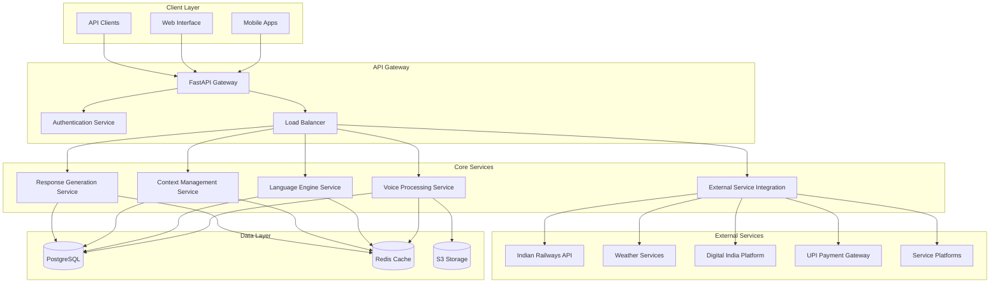

# Design Document: BharatVoice Assistant

## Overview

BharatVoice Assistant is a sophisticated AI-powered multilingual voice assistant specifically designed for India's diverse linguistic and cultural landscape. The system employs a microservices architecture to provide scalable, reliable voice interactions in 10+ Indian languages while maintaining cultural sensitivity and supporting offline-first usage patterns for rural and semi-urban populations.

The architecture is built around five core services: Voice Processing, Language Engine, Context Management, Response Generation, and External Service Integration. Each service is designed to handle specific aspects of the voice interaction pipeline while maintaining loose coupling and high cohesion. The system supports both cloud-based and offline processing modes, with intelligent synchronization and fallback mechanisms.

Key design principles include:
- **Cultural Intelligence**: Deep understanding of Indian languages, customs, and regional variations
- **Offline-First**: Core functionality available without internet connectivity
- **Adaptive Learning**: Continuous improvement through user interaction patterns
- **Privacy Compliance**: Full adherence to Indian data protection laws
- **Scalable Architecture**: Microservices design supporting millions of concurrent users

## Architecture

The BharatVoice Assistant follows a distributed microservices architecture deployed on AWS infrastructure with Kubernetes orchestration. The system is designed to handle the unique challenges of the Indian market: diverse languages, varying network conditions, cultural sensitivity, and cost optimization.



### Service Communication

Services communicate through a combination of synchronous REST APIs and asynchronous message queues. The API Gateway handles request routing, authentication, and load balancing. Each service maintains its own database schema while sharing common infrastructure components.

**Request Flow:**
1. Client sends voice/text request to API Gateway
2. Gateway authenticates request and routes to appropriate service
3. Voice Processing Service handles audio conversion (if needed)
4. Language Engine Service processes multilingual content
5. Context Management Service retrieves user context and conversation state
6. Response Generation Service creates culturally appropriate response
7. External Service Integration handles third-party API calls (if needed)
8. Response is returned through the same path with appropriate caching

### Deployment Architecture

The system is deployed using Kubernetes on AWS with the following infrastructure:
- **EKS Cluster**: Managed Kubernetes for service orchestration
- **RDS PostgreSQL**: Primary database with read replicas
- **ElastiCache Redis**: Distributed caching and session storage
- **S3**: Audio file storage and model artifacts
- **CloudFront**: CDN for static assets and audio delivery
- **Application Load Balancer**: Traffic distribution and SSL termination

## Components and Interfaces

### Voice Processing Service

The Voice Processing Service handles all audio-related operations including speech-to-text (ASR), text-to-speech (TTS), and audio preprocessing. It's designed to work with multiple audio formats and optimize for Indian network conditions.

**Core Components:**
- **Audio Processor**: Handles noise reduction, format conversion, and audio enhancement
- **TTS Engine**: Generates natural speech in multiple Indian languages with gTTS integration
- **Audio Buffer Manager**: Manages streaming audio and temporary file handling
- **Quality Optimizer**: Adapts audio quality based on network conditions

**Key Interfaces:**
```python
class VoiceProcessingService:
    async def synthesize_speech(self, text: str, language: str, user_preferences: dict) -> AudioResponse
    async def process_audio_stream(self, audio_stream: bytes, format: str) -> ProcessedAudio
    async def enhance_audio_quality(self, audio: bytes, noise_profile: dict) -> bytes
    async def adapt_tts_preferences(self, user_id: str, feedback: dict) -> bool
```

### Language Engine Service

The Language Engine Service is the core of multilingual processing, handling speech recognition, translation, code-switching detection, and language model operations. It uses Whisper for ASR and custom models for Indian language processing.

**Core Components:**
- **Whisper ASR Engine**: Speech recognition with Indian language support
- **Code-Switching Detector**: Identifies language transitions within utterances
- **Translation Engine**: Handles translation with cultural context preservation
- **Language Model Adapter**: Adapts models for regional accents and dialects

**Key Interfaces:**
```python
class LanguageEngineService:
    async def recognize_speech(self, audio: bytes, language_hint: str) -> RecognitionResult
    async def detect_code_switching(self, text: str) -> CodeSwitchingResult
    async def translate_with_context(self, text: str, source_lang: str, target_lang: str, context: dict) -> str
    async def adapt_to_accent(self, user_id: str, audio_samples: List[bytes]) -> bool
```

### Context Management Service

The Context Management Service maintains user profiles, conversation state, regional context, and learning data. It ensures privacy compliance while enabling personalized experiences.

**Core Components:**
- **User Profile Manager**: Handles encrypted user data and preferences
- **Conversation State Manager**: Maintains session state and conversation history
- **Regional Context Provider**: Supplies location-based cultural and service information
- **Privacy Compliance Engine**: Ensures data handling meets Indian privacy laws

**Key Interfaces:**
```python
class ContextManagementService:
    async def get_user_profile(self, user_id: str) -> UserProfile
    async def update_conversation_state(self, session_id: str, state: dict) -> bool
    async def get_regional_context(self, location: str) -> RegionalContext
    async def learn_from_interaction(self, user_id: str, interaction: dict) -> bool
```

### Response Generation Service

The Response Generation Service creates culturally appropriate, contextually relevant responses in multiple languages. It handles natural language understanding, intent classification, and response formatting.

**Core Components:**
- **NLU Engine**: Intent classification and entity extraction for Indian context
- **Cultural Context Interpreter**: Understands Indian cultural references and customs
- **Multilingual Response Generator**: Creates responses with proper localization
- **Code-Switching Generator**: Produces natural language mixing when appropriate

**Key Interfaces:**
```python
class ResponseGenerationService:
    async def generate_response(self, query: str, context: dict, user_profile: dict) -> Response
    async def classify_intent(self, text: str, cultural_context: dict) -> Intent
    async def extract_entities(self, text: str, language: str) -> List[Entity]
    async def format_for_culture(self, response: str, region: str, user_prefs: dict) -> str
```

### External Service Integration

The External Service Integration handles connections to Indian Railways, weather services, Digital India platforms, UPI payments, and other third-party services with proper error handling and fallback mechanisms.

**Core Components:**
- **Indian Railways Connector**: Train schedules, bookings, and route planning
- **Weather Service Connector**: Location-specific weather with monsoon information
- **Digital India Connector**: Government service access and guidance
- **UPI Payment Processor**: Secure voice-guided payment transactions
- **Platform Integrators**: Food delivery, ride-sharing, and other service platforms

**Key Interfaces:**
```python
class ExternalServiceIntegration:
    async def get_train_info(self, query: dict) -> TrainInfo
    async def get_weather_info(self, location: str) -> WeatherInfo
    async def access_government_service(self, service_type: str, user_context: dict) -> ServiceInfo
    async def process_upi_payment(self, payment_request: dict) -> PaymentResult
```

## Data Models

### User Profile Model

The User Profile model stores user preferences, learning data, and privacy settings with full encryption and compliance features.

```python
class UserProfile(BaseModel):
    user_id: str
    preferred_languages: List[str]
    regional_context: RegionalContext
    voice_preferences: VoicePreferences
    privacy_settings: PrivacySettings
    learning_data: EncryptedLearningData
    accessibility_needs: AccessibilitySettings
    created_at: datetime
    last_updated: datetime
    
class VoicePreferences(BaseModel):
    speech_rate: float  # 0.5 to 2.0
    volume_level: float  # 0.0 to 1.0
    preferred_accent: str
    tts_voice_id: Optional[str]
    
class PrivacySettings(BaseModel):
    data_retention_days: int
    allow_learning: bool
    allow_analytics: bool
    consent_timestamp: datetime
```

### Conversation State Model

The Conversation State model maintains session information and conversation history for context-aware interactions.

```python
class ConversationState(BaseModel):
    session_id: str
    user_id: str
    current_intent: Optional[str]
    conversation_history: List[ConversationTurn]
    context_variables: Dict[str, Any]
    active_services: List[str]
    session_start: datetime
    last_activity: datetime
    
class ConversationTurn(BaseModel):
    turn_id: str
    timestamp: datetime
    user_input: str
    detected_language: str
    intent: str
    entities: List[Entity]
    system_response: str
    response_language: str
```

### Audio Processing Model

The Audio Processing model handles audio data, metadata, and processing results.

```python
class AudioData(BaseModel):
    audio_id: str
    user_id: str
    audio_format: str  # wav, mp3, flac
    sample_rate: int
    duration_seconds: float
    file_path: str
    noise_profile: Optional[NoiseProfile]
    processing_metadata: ProcessingMetadata
    
class ProcessingMetadata(BaseModel):
    noise_reduction_applied: bool
    format_conversion: Optional[str]
    quality_enhancement: bool
    compression_ratio: Optional[float]
    processing_time_ms: int
```

### Language Processing Model

The Language Processing model stores multilingual processing results and language detection information.

```python
class LanguageProcessingResult(BaseModel):
    processing_id: str
    input_text: str
    detected_languages: List[LanguageDetection]
    code_switching_points: List[CodeSwitchPoint]
    translation_results: Optional[List[Translation]]
    confidence_scores: Dict[str, float]
    
class LanguageDetection(BaseModel):
    language_code: str
    confidence: float
    start_position: int
    end_position: int
    
class CodeSwitchPoint(BaseModel):
    position: int
    from_language: str
    to_language: str
    confidence: float
```

### External Service Model

The External Service model manages third-party service interactions and caching.

```python
class ServiceRequest(BaseModel):
    request_id: str
    service_type: str  # railways, weather, digital_india, upi, platform
    user_id: str
    query_parameters: Dict[str, Any]
    timestamp: datetime
    
class ServiceResponse(BaseModel):
    request_id: str
    service_type: str
    response_data: Dict[str, Any]
    cache_duration: int
    error_info: Optional[ErrorInfo]
    processing_time_ms: int
    
class ErrorInfo(BaseModel):
    error_code: str
    error_message: str
    retry_after: Optional[int]
    fallback_available: bool
```

### Regional Context Model

The Regional Context model provides location-based cultural and service information.

```python
class RegionalContext(BaseModel):
    region_id: str
    state: str
    primary_languages: List[str]
    cultural_context: CulturalContext
    local_services: List[LocalService]
    weather_preferences: WeatherPreferences
    
class CulturalContext(BaseModel):
    festivals: List[Festival]
    customs: List[Custom]
    honorifics: Dict[str, str]
    greetings: Dict[str, List[str]]
    
class LocalService(BaseModel):
    service_type: str
    service_name: str
    availability: str
    contact_info: Optional[str]
```

## Correctness Properties

*A property is a characteristic or behavior that should hold true across all valid executions of a system—essentially, a formal statement about what the system should do. Properties serve as the bridge between human-readable specifications and machine-verifiable correctness guarantees.*

Based on the prework analysis of acceptance criteria, the following correctness properties ensure the BharatVoice Assistant meets all functional requirements across all valid inputs and scenarios.

### Property 1: Multilingual Speech Recognition Accuracy
*For any* audio input in supported Indian languages, the Voice_Processor should achieve at least 85% recognition accuracy, and for audio with background noise, accuracy should remain above 75%
**Validates: Requirements 1.1, 1.3**

### Property 2: Adaptive Learning Convergence
*For any* user providing repeated interactions with specific vocabulary, accents, or feedback, the Language_Engine should demonstrate measurable improvement in recognition accuracy and response quality over time
**Validates: Requirements 1.2, 9.1, 9.2**

### Property 3: Code-Switching Detection and Processing
*For any* utterance containing language transitions between supported Indian languages, the Language_Engine should correctly identify all switching points and process the complete multilingual utterance accurately
**Validates: Requirements 1.4**

### Property 4: Audio Enhancement Under Degraded Conditions
*For any* audio input with quality degradation (network compression, noise, low bandwidth), the Voice_Processor should apply appropriate enhancement techniques that improve recognition accuracy compared to unenhanced processing
**Validates: Requirements 1.5, 3.5**

### Property 5: Cultural Context Recognition and Response
*For any* query containing Indian cultural references (festivals, customs, regional terms), the Response_Generator should provide culturally appropriate responses using correct honorifics, greetings, and cultural expressions for the user's region
**Validates: Requirements 2.1, 2.3, 2.5**

### Property 6: Regional Context Adaptation
*For any* location-based query, the Context_Manager should provide region-specific information and culturally relevant answers that match the local context and service availability
**Validates: Requirements 2.2**

### Property 7: Indian Localization Standards
*For any* response containing currency, measurements, time references, or technical terms, the Response_Generator should format them according to Indian standards and pronounce them correctly according to Indian pronunciation conventions
**Validates: Requirements 2.4, 3.3**

### Property 8: Natural Multilingual Speech Synthesis
*For any* text input in supported languages, including code-switched content, the Voice_Processor should generate natural-sounding speech with seamless language transitions and appropriate pronunciation
**Validates: Requirements 3.1, 3.2**

### Property 9: TTS Personalization Adaptation
*For any* user feedback on speech preferences (rate, volume, accent), the Voice_Processor should adapt TTS parameters accordingly and maintain these preferences across sessions
**Validates: Requirements 3.4**

### Property 10: Offline Functionality Preservation
*For any* common query type, when internet connectivity is unavailable, the Offline_Processor should provide basic voice recognition and access to cached responses while maintaining conversation continuity
**Validates: Requirements 4.1, 4.2, 4.4**

### Property 11: Data Synchronization Round-Trip
*For any* offline interaction, when connectivity is restored, the BharatVoice_System should synchronize all offline data with cloud services such that no information is lost and conflicts are resolved appropriately
**Validates: Requirements 4.3**

### Property 12: Intelligent Cache Management
*For any* offline storage scenario approaching capacity limits, the Offline_Processor should prioritize most relevant content based on usage patterns and user preferences
**Validates: Requirements 4.5**

### Property 13: External Service Integration Reliability
*For any* supported external service query (railways, weather, government services, UPI payments), the External_Service_Integrator should provide accurate information when services are available, and appropriate cached responses with status notifications when services are unavailable
**Validates: Requirements 5.1, 5.2, 5.3, 5.4, 5.5**

### Property 14: Authentication and Privacy Security
*For any* user authentication or data processing operation, the BharatVoice_System should use secure JWT-based authentication, encrypt all voice data end-to-end, comply with Indian data protection laws, and handle data deletion requests within legal timeframes
**Validates: Requirements 6.1, 6.2, 6.3, 6.4**

### Property 15: Multilingual Privacy Compliance
*For any* consent collection or privacy notice, the BharatVoice_System should provide clear, understandable information in the user's preferred language
**Validates: Requirements 6.5**

### Property 16: Performance Response Times
*For any* simple query under normal network conditions, the BharatVoice_System should respond within 2 seconds, and for complex multilingual queries, within 5 seconds
**Validates: Requirements 7.1, 7.2**

### Property 17: Concurrent Load Handling
*For any* concurrent user load within system capacity, the BharatVoice_System should maintain performance through intelligent load balancing and provide appropriate queuing with status updates during high load periods
**Validates: Requirements 7.3, 7.4**

### Property 18: Localized Error Handling
*For any* system error or failure condition, the BharatVoice_System should provide localized error messages and recovery suggestions in the user's preferred language
**Validates: Requirements 7.5, 12.4**

### Property 19: Accessibility Support Comprehensiveness
*For any* accessibility need (hearing difficulties, extended response time, mode switching, tutorial needs, visual indicators), the BharatVoice_System should provide appropriate accommodations and clear guidance
**Validates: Requirements 8.1, 8.2, 8.3, 8.4, 8.5**

### Property 20: Regional Preference Learning
*For any* user demonstrating regional preferences or usage pattern changes, the Context_Manager should adapt responses to match local cultural context while maintaining privacy compliance
**Validates: Requirements 9.3, 9.4**

### Property 21: Language Capability Expansion
*For any* new language or dialect input, the Language_Engine should expand its capabilities through machine learning while maintaining performance for existing languages
**Validates: Requirements 9.5**

### Property 22: System Extensibility Framework
*For any* new language plugin, external service integration, or ML model update, the BharatVoice_System should support seamless integration using standardized APIs while maintaining backward compatibility with existing user data
**Validates: Requirements 10.1, 10.2, 10.3**

### Property 23: Deployment and Scaling Capabilities
*For any* new feature deployment or infrastructure scaling requirement, the BharatVoice_System should support A/B testing, gradual rollout, and auto-scaling based on load and performance metrics
**Validates: Requirements 10.4, 10.5**

### Property 24: Data Serialization Round-Trip Consistency
*For any* system data (user profiles, conversation context, voice recognition results, external API responses, cached offline data), serialization followed by deserialization should produce equivalent data with proper validation and integrity checks
**Validates: Requirements 11.1, 11.2, 11.3, 11.4, 11.5**

### Property 25: Comprehensive Error Recovery
*For any* failure condition (network connectivity loss, external service unavailability, voice recognition failure, data corruption), the BharatVoice_System should handle the error gracefully, provide appropriate fallbacks, log errors appropriately, and attempt recovery where possible
**Validates: Requirements 12.1, 12.2, 12.3, 12.5**

## Error Handling

The BharatVoice Assistant implements comprehensive error handling across all system components to ensure graceful degradation and user-friendly error recovery.

### Error Classification

**Network Errors:**
- Connectivity loss: Automatic switch to offline mode with user notification
- Bandwidth limitations: Audio quality optimization and compression
- Service timeouts: Retry with exponential backoff and fallback to cached data

**Processing Errors:**
- Speech recognition failures: Request clarification and offer alternative input methods
- Translation errors: Fallback to original language with explanation
- Context retrieval failures: Use default context with limited functionality

**External Service Errors:**
- API unavailability: Serve cached responses with status notifications
- Authentication failures: Secure re-authentication flow with user guidance
- Rate limiting: Intelligent request queuing with user status updates

**Data Errors:**
- Corruption detection: Automatic recovery attempts with admin notification
- Validation failures: Clear error messages with correction suggestions
- Storage failures: Redundant storage with automatic failover

### Error Recovery Strategies

**Graceful Degradation:**
- Offline mode activation when cloud services unavailable
- Reduced functionality with clear user communication
- Cached response serving with freshness indicators

**User Communication:**
- Localized error messages in user's preferred language
- Clear recovery instructions and alternative options
- Proactive status updates during service disruptions

**System Recovery:**
- Automatic retry mechanisms with intelligent backoff
- Health check monitoring with automatic service restart
- Data integrity verification and repair procedures

## Testing Strategy

The BharatVoice Assistant employs a comprehensive dual testing approach combining unit tests for specific scenarios and property-based tests for universal correctness validation.

### Property-Based Testing Framework

**Testing Library:** pytest with Hypothesis for Python components
**Test Configuration:** Minimum 100 iterations per property test to ensure comprehensive input coverage
**Test Tagging:** Each property test references its corresponding design document property

**Property Test Structure:**
```python
@given(audio_input=audio_strategy(), language=indian_language_strategy())
def test_multilingual_recognition_accuracy(audio_input, language):
    """
    Feature: bharatvoice-assistant, Property 1: Multilingual Speech Recognition Accuracy
    For any audio input in supported Indian languages, recognition accuracy should be >= 85%
    """
    result = voice_processor.recognize_speech(audio_input, language)
    assert result.accuracy >= 0.85
    if audio_input.has_background_noise:
        assert result.accuracy >= 0.75
```

### Unit Testing Strategy

**Focus Areas:**
- Specific examples demonstrating correct behavior
- Edge cases and boundary conditions
- Integration points between microservices
- Error conditions and recovery scenarios

**Test Coverage:**
- Component integration testing for service interactions
- Cultural context validation with real Indian examples
- Performance testing under simulated Indian network conditions
- Security testing for authentication and data protection

### Testing Data Generation

**Audio Test Data:**
- Synthetic audio in 10+ Indian languages
- Real-world noise profiles from Indian environments
- Code-switched utterances with various language combinations
- Regional accent variations and dialect samples

**Cultural Context Data:**
- Indian festival and cultural event calendars
- Regional service availability databases
- Government service process workflows
- Local language honorific and greeting patterns

**Performance Test Scenarios:**
- Concurrent user load simulation
- Network condition variations (2G, 3G, 4G, WiFi)
- Service degradation and recovery scenarios
- Offline/online mode transition testing

### Continuous Testing Pipeline

**Automated Testing:**
- Property-based tests run on every code change
- Performance regression testing with Indian network simulation
- Cultural context validation with updated regional data
- Security scanning for privacy compliance

**Manual Testing:**
- User experience testing with native speakers
- Cultural appropriateness validation by regional experts
- Accessibility testing with users having various needs
- End-to-end workflow validation for real use cases